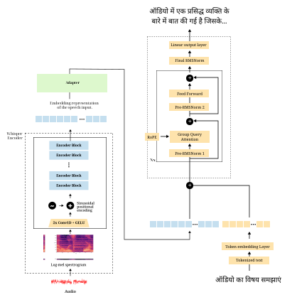

# Vocal LLM

**Cost-Efficient Joint Audio-Language Modeling via Lightweight Projector Training over Frozen Foundations**

Vocal LLM is a joint audio-language model that bridges a frozen [Whisper](https://huggingface.co/openai/whisper-medium) speech encoder with the [Sarvam-M](https://huggingface.co/sarvamai/sarvam-m) 24B Indic LLM through a lightweight trainable projector. The entire model was trained for **~$10** on a **single NVIDIA A100 GPU** in approximately **6 hours**.

## Architecture



Vocal LLM consists of three components:

| Component | Model | Parameters | Status |
|---|---|---|---|
| Speech Encoder | `openai/whisper-medium` | ~300M | Frozen |
| Multimodal Projector | Two-layer MLP (GELU + LayerNorm) | ~60M | Trained |
| Language Model | `sarvamai/sarvam-m` (Mistral-based, 24B) | ~24B | LoRA-adapted (~103M trainable) |

**Total trainable parameters: <3% of the full model.**

### How it works

1. **Audio encoding** — Raw audio is resampled to 16 kHz, converted to a log-mel spectrogram, and processed by the frozen Whisper encoder to produce 1024-dim embeddings at 50 frames/sec.
2. **Projection** — The MLP projector stacks 8 consecutive frames (8x temporal downsampling) and maps them into the LLM's 2048-dim input space. A 30-second clip becomes ~188 pseudo-tokens.
3. **Text generation** — Projected audio tokens are concatenated with text instruction tokens and processed by the LoRA-adapted Sarvam-M LLM to generate the response.

## Training

Training follows a two-stage pipeline:

**Stage 1: Projector Pre-training** — Alignment between Whisper's speech representations and Sarvam-M's text embedding space using 10K audio continuation pairs from Mozilla Common Voice (Hindi). Only the projector MLP is trained. 1 epoch, AdamW, lr=1e-4, bfloat16.

**Stage 2: Instruction Fine-tuning** — 3,000 synthetic Hindi audio question-answer pairs. Both the projector and LoRA adapters (rank 16, alpha=32, applied to all attention projections) are trained. 3 epochs, lr=5e-5.

The synthetic dataset was generated by prompting a text-only LLM with ASR transcripts to create instruction-answer pairs — **10-50x cheaper** than processing raw audio through multimodal APIs.

## Capabilities

- **Hindi audio question answering** — Given audio + a question, generates contextually relevant Hindi responses
- **Cross-lingual understanding** — Translates Hindi speech to English text
- **Audio transcription** — Transcribes Hindi speech leveraging Whisper's multilingual capabilities
- **Content summarization** — Summarizes audio content in Hindi or English

## Usage

```python
# Inference format
# User: [INST] Based on the provided audio, answer the following question: {Q} <|audio|> [/INST]
# Assistant: {Answer}

# During the forward pass, the <|audio|> placeholder is replaced
# with the projected audio pseudo-tokens from the Whisper encoder + MLP projector.
```

## Limitations

- **Hallucination** — May occasionally generate fluent but factually incorrect responses
- **Limited vocabulary** — Trained on only 3,000 samples; restricted Hindi vocabulary coverage
- **Length sensitivity** — Audio clips significantly longer/shorter than training distribution may produce degraded outputs
- **Noise sensitivity** — Background noise or atypical speaking patterns can cause incoherent output

## Cost Comparison

| Model | GPUs | Hours | Est. Cost |
|---|---|---|---|
| AudioPaLM | 1000s | 1000s | $1M+ |
| SeamlessM4T | 1000s | 1000s | $500K+ |
| SpeechGPT | 96xA100 | 72+ | $50K+ |
| SALMONN | 8xA100 | 100+ | $5K+ |
| Qwen-Audio | 32xA100 | 100+ | $20K+ |
| Shuka v1 | — | — | <$1K |
| **Vocal LLM (Ours)** | **1xA100** | **6** | **~$10** |

## Citation

```bibtex
@article{vocalllm2026,
  title={Vocal LLM: Cost-Efficient Joint Audio-Language Modeling
         via Lightweight Projector Training over Frozen Foundations},
  author={Team Vizuara},
  year={2026}
}
```

## Links

- [Project Page](https://huggingface.co/teamvizuara/Vocal-LLM)
- [GitHub (Code)](https://github.com/)
